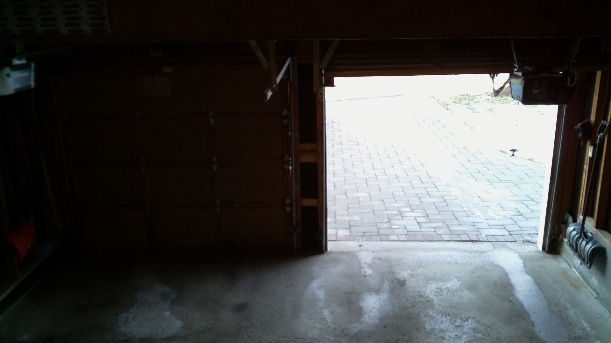
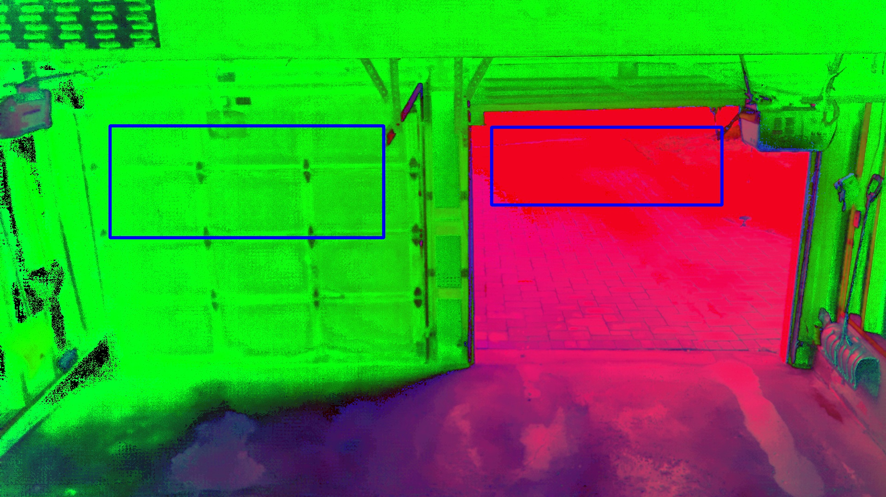
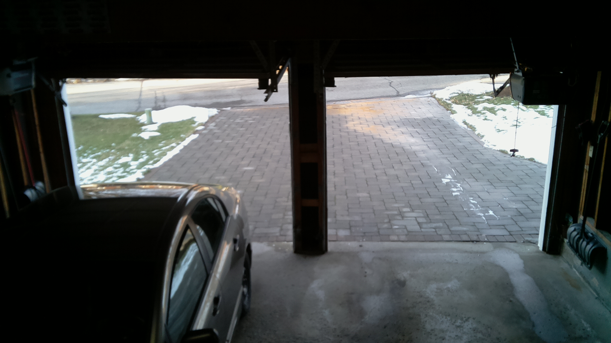
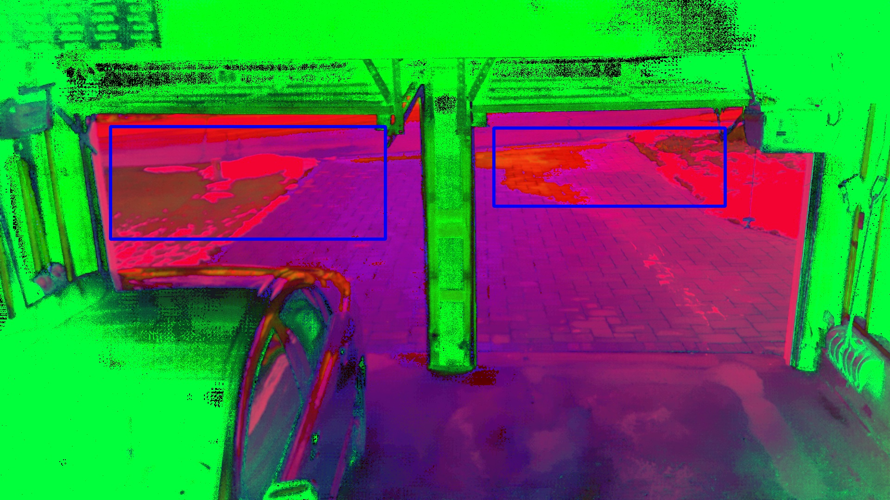
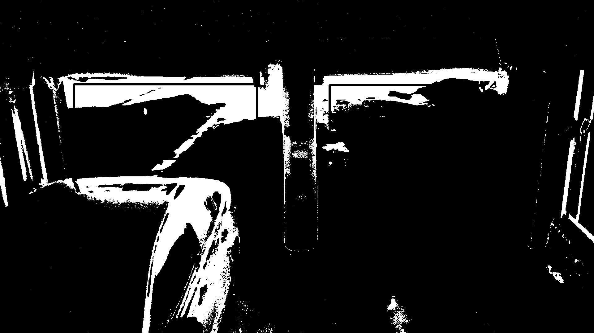
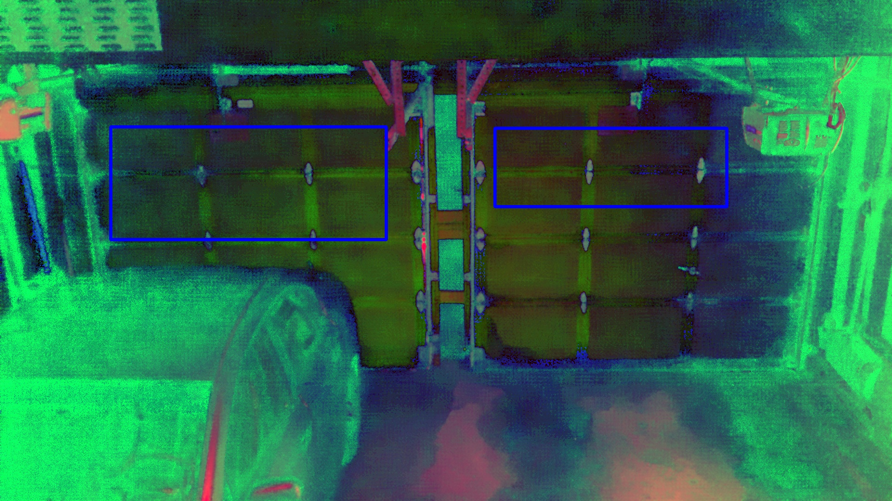
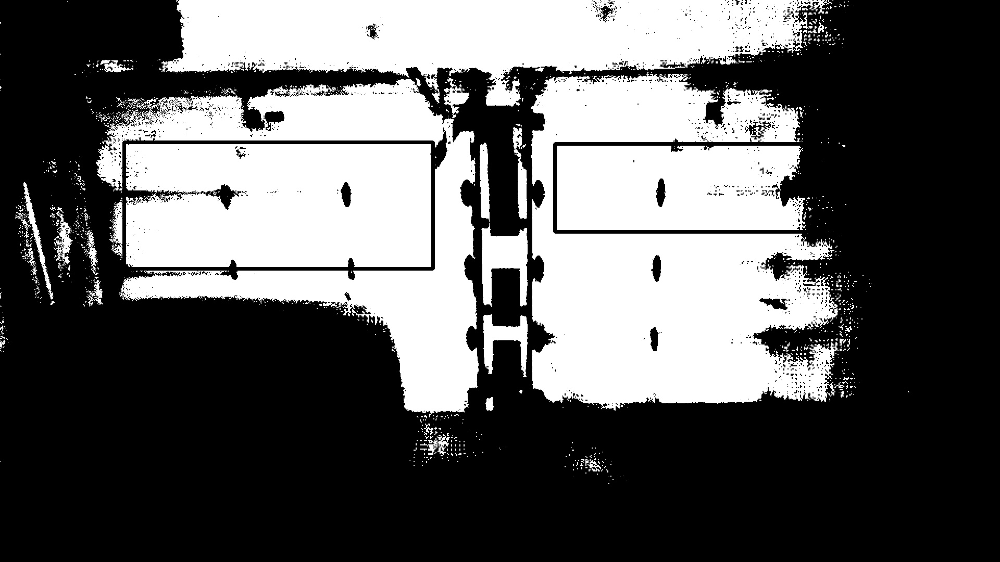

# Garage Door Recognizer (Computer Vision)

Utilize OpenCV to determine when my Garage Doors are open and send an Email and SMS notification via SMTP and Twilio when they are open for longer than 5 minutes.

## How it Works

### With One Door Open

This is the original photo that the Rasberry Pi has captured.



The image is then converted to HSV for image processing.



A color range is then applied to detect whether or not the garage door is open or not. You can then count the non zero pixels and determine whether or not the door is open, according to your threshold.


### With Both Doors Open





### With Two Doors Closed




### Prerequisites

You will need to install all pip libraries and also some packages for your Raspberry Pi (I used Zero W)

```
pip install -r requirements.txt
```

You will have to install all missing packages on your host machine as well (if you're using Raspberry Pi). Some packages may not exist.

```
cat requirements-rpbizero.txt | xargs sudo apt-get install
```

## Deployment

Add a cronjob that runs wrapper.py every 5 minutes or however long you would like to check. You will also need to create a .env file with the following configurations:

```
account_sid=<twilio account_ssid>
auth_token=<twilio auth_token>
email_list=<email list in comma delimited list form with no spaces>
gmail_pass=<gmail password>
email_list_dev=<developer email for additional information such as image masks and the hsv photo>
to_sms_number=<to sms number>
from_sms_number=<from sms number>
```

## Built With

* [OpenCV](https://opencv.org/) - Image processing library
